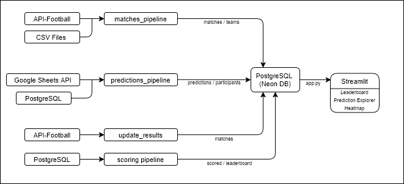
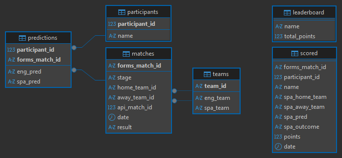
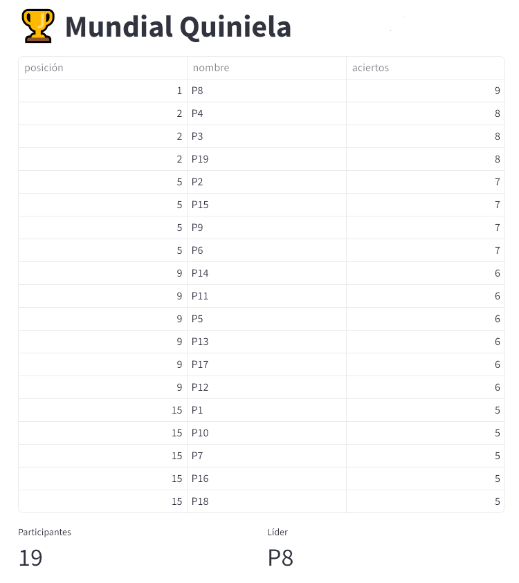
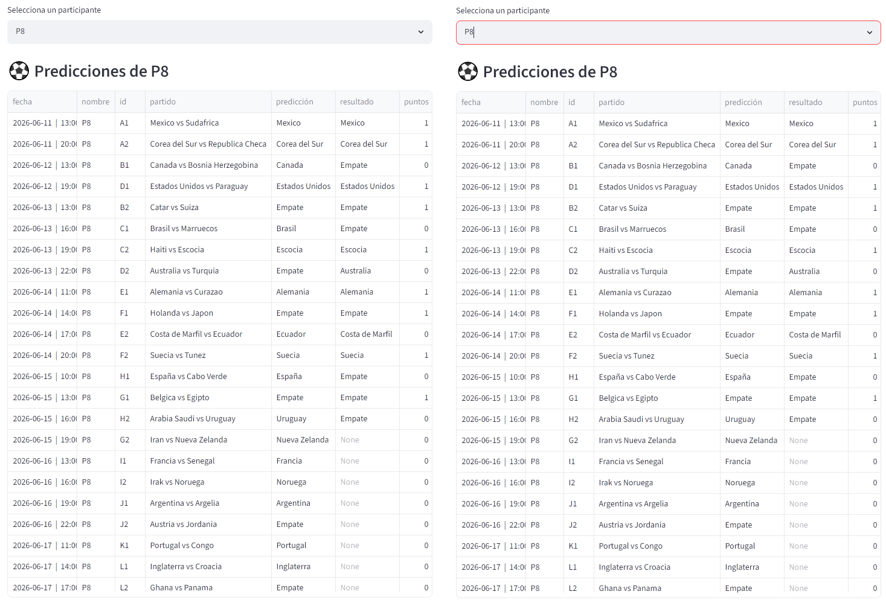
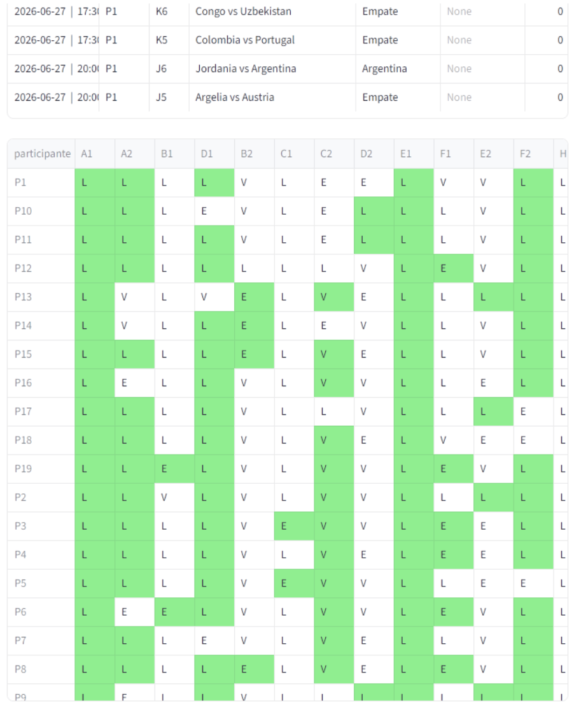

# World Cup Pool

A web application for managing and tracking FIFA World Cup 2026 predictions. 
      
      - Participants submit match predictions via Google Forms.
      
      - Results are automatically updated from API-Football and predictions are scored after every result update. 
      
      - Leaderboard, participant predicitons and map of correct answers are displayed through an interactive dashboard (Streamlit).

## Features

- PostgreSQL database hosted on NeonDB.

- Scheduled updates via GitHub Actions.

      - Automated match result updates from API-Football.

      - Automated scoring pipeline.

- Streamlit web dashboard.

      - Leaderboard rankings.

      - Participant prediction explorer.

      - Correct predictions map.

## Tech Stack 

Data Engineering
- Python
- Pandas
- PostgreSQL
- SQLAlchemy

Infrastructure
- Neon Database
- GitHub Actions
- GitHub

Frontend
- Streamlit Community Cloud

Data Source
- SportsDB API
- Google Sheets API

## Project Architecture

## Database schema

## Streamlit App Screenshots
Screenshots use anonymized participant names for privacy.

### Leaderboard

### Predictions by participants

### Map of correct predictions

